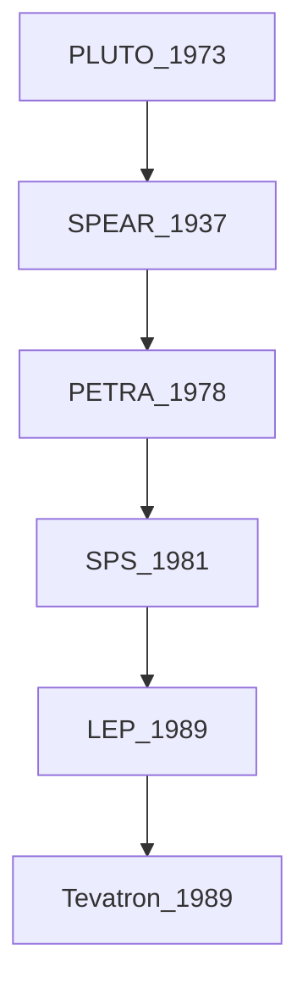

---
tags:
  - type/lecture
  - context/HEP_Herbstschule2025
  - topic/detector_physics
aliases:
---
Jochen Dingfelder - University of Bohn 

Interdiceplinary field, Chemistry, Mechanics, Thermodynamics, different technologies
# 3rd September 2025 Introduction and interactions with matter
- Basic paticle detection principle
	- Particle passing though material, interacting and depositing energy
- Cloud chamber, bubble chamber, photographic/nuclear emulsion detectors, Spark chember (HV metall plates surrounded by gas, sparks when a particle flys through)
	- not capable of high rates, dead time, evaluation of pictures
	### Electronic read out: 
	- Amplifier (transforms smal Charge signal I into bigger voltage signal) and Logger 
		- photographic
		- gas, cloud chamber
		- light emission
		- solid states
- What do we want the detectors to do? 
	- $E, p$ *positionn/angles*
	$E+ p$ - mass $m$ identity 
	- Magnatic fields
	### Discovery of $B^0$ micing at ARGUS
	- We only measure the stable particles
		- long lived charge $e, \mu, K,\pi,p,\alpha$
	- photons, neutron 
	- Flight length depends on the momentim 
		- $= \beta\gamma c\tau = p/m c\tau$ (m)
		- Sometimes you can see In-flight decays (Pion, Kaon, $K_L$ mesons) (~10m)
		- Tauon and D meson are at the edge - silicon detectors (~$10^{-4}$ m)
- Layers of detectors 
	- tracking detectors
		- silicon detectors
		- gas detectors
	- Calorimeter
		- Electromagnetic
		- Hadronic
		- Homogenous and sampli 
	- Muon detectors
		- Tracking devices on the outside
	### Example: CMS (Slide 12)
Evolution of collider detectors: 

Differnent detector examples: 
CMS and ATLAS are quite different
Cherencov rings  - BaBar positron electon collison 

Super Kamiokande, IceCube - is not round!!!
## Detector developmet cycle
- crazy idea detector (glued detector)
- does it see particle fundamental R&D
- Prototyping proof of concept
- System R&D
- Full development
## Interaction of particle with matter
Charge particles
- Large number of *primary* electromagentic interactions
- Continues energy loss by elastic and inelastic scattering

photons
- Absorption by photoefect
- Exponential energy loss
- Mean free path
### Interactions of charged particles (Slide 26)
- collect energy $\Delta E$ from the material 
	- Ionization of atoms
	- Exitations of atoms
	- Bemsstrahlung
	- Cherencov radiation 
	- Transition radiation - when the  material changes-  refractive index is changed
- Linear stoping power MeV/cm$^2$ 
- Mass stopping power
	#### **Ionization** 
	- small energy loss -dE 
	- **Bethe-Bloch Formula** 

	$T_{max}$ Maximum kinetic energy which can be transferred to the electron in a single collision
	$I^2$ mean excitation Energy  - modeled from data
	$\frac{\delta}{2}$ Density term due to polarisation: leads to saturation at higher energies 
	$\frac{C}{Z}$ Shell correction term only relevant at lower energies
- At low energies you have to take into account the shell structure of the atom - take into account the quantum dynamics
- Understand the slope of the Mass stoping power over the momentum 
- 0.1 < $\beta\gamma$ < 1: 
- $\beta\gamma~3-4$: Minimum Ionizing particles (MIPs) #topic/detector_physics/mip
	- the time that the particle sees the electric field of the particle 
- $\beta\gamma<0.1$ particle velocity $\approx$ shell electon velocity **Andersen-Ziegler**
	- Energy- dependet shell conditions
- $\beta\gamma<0.01$ non relativistic - not included in Bethe-Bloch Formula 
- $\beta\gamma > 5$ dE/dx $\propto ln(\beta\gamma)$ *logarithmic rise*
	- Kinematic effect
	- Relativistic effect - lateral extension of particles em field
	- Density effect - screening effect 
	- *Radiative losses*  start to dominate
		- Bremsstrahlung if the particle is accelerated "bended" around the atoms
			- only important for electrons and ultra relativistic muons (>TeV)
	### Range and Bragg peak
	- Bragg peak - sharp peak in dE/dx at the end of the track when particle comes to rest in the material
	- Application in proton therapy
	### Material dependence of the energy loss
	- **Rule of thumb** - Energy loss  - approxematly independent of the material  1-2 MeV g$^{-1}$ cm $^{-1}$
- Use this for Particle Identification (PID) 
	- If you measure energy deposit and momentum 
# 5th September 2025 
## Energy loss - a closer look 
- Energy loss is **statistical process**
- $\delta$ - electrons = relatively high energy electrons produced in ioization 
- emitted with a large angle
- Landau fluctuations $\Delta E = \sum \delta E_n$ most of them are low energy, but some high energy transfers -> Landau Distribution
- Thin material - long tail 
- Thick material shorter tail 
	### Impact of Landau fluctuations on measurements
	-  Degrates spacial resolution in tracking due to $\delta$-electrons (slide 42)
	- Momentum measurement Curvature of muon track increases with flight distance in magnetic field
	### Energy loss for electrons
	- Bethe Bloch formular only valid for *heavy* particles not electrons
	- Incident and target electrons have same mass $m_e$
	- Scaterring of identical, indistinguishable particles - additiol processses
	- **Bremsstrahlung** already dominant at rather low energies (10-100MeV)
	### Critical energy and radiation length 
	- Radiation length $X_0$ goes down with $Z^2$ = Length after which particles has lost all but 1/e energy
	- Detector R&D - quantify the amount of material  - given in units of $X_0$
	- **Z** dependence due to **incoherent** scattering off shell electrons (it only sees a fraction of the charge of the atom)
	- $Z^2$ dependence due to **coherent** scattering on the nucleus - on full charge
	### Multiple Coulomb scattering - deflection from original particle direction 
	- Uncertainty due to multiple scattering **Highland Formula** - becomes more important the lower the energy of the particles
	- Gaussian approximation but in reality **Rutherford scattering**
	- Example on silde 53
	### Interactions of photons with matter
	- **photoelectric effect** ~$Z^{\approx5}$
	- **Compton scattering** (inelastic)  ~$Z$ 
	- **pair production**  ~$Z^2$
	- Many more that transfere not that much energy - not important for detecttion 
		- Thomson scattering  (elastic comptons)
		- Rayleigh scattering 
		- Nuclear photoeffect (a lot of energy but pair production dominent) why is it a peak and not "a distribution"
		- ... slide 58
	- Pair production in electron field
	- Dependence of the different effects on different materials (Z)
## Detector Concepts and design considerations
- Conceptual design of HEP detectors
- Detailed understanding 
	- processes 
	- signatures, energies
	- background condition 
- Decide on magnetic field
- Calorimeter choise 
- Tracker 
- **Symmetric vs. asymmetric design**
- asymmetric usefull if you have different energy particles (e-, e+, p)
- **B-Field configuration** 
	- Solenoid (CMS)
	- Toroid (ATLAS) particles are not bent in the perpendicular plane
	- Dipol (LHCb) - mostly for beam dump/ measurements in the forward direction
- **High vs low particle momenta**
	- for low momentum particles, multiple scattering is a limiting factor
- **Radiation damage**
## Tracking detectors
- Measurement: 
	- Trajectory 
	- Momentum 
	- Charge
- should not disturb the particle 
- Technologies
	- Wire chambers
	- Micro-pattern gas detectors
	- scintillating detectors
	### Position measurement and resolution 
	- depends in detector geometry and charge collection 
		- pitch (distance between neighboring channels)
		- Charge sharing between channels
	- **Binary resolution** - $\sigma = \frac{d}{\sqrt{12}}$
	- **Centroid resolution** $\sigma \propto \frac{d}{S/N}$
	###  Momentum resolution
	- **Gluckstern formula** slide 11
		- Position resolution - its good to make your tracker large
		- Multiple scattering - dominant for low momenta
### Gas filled detectors 
- Gas volume with E-field
- Charged particles ionizes the gas 
- Modes of operation (Slide 14)
	1. Recombination region (low e-field)
	2. Ionization chamber region 
	3. Proportionality region  - charge is already multiplied - linear to deposited energy 
	4. Region of limited proportionality - space charge build up shields the E-Field
	5. Geiger region - very large voltages, UV photons emitted from the deexitation of molecules spred charge to other parts of the detector *"you get signal everywhere*
	6. Discharge region
	### Types of gas-field detectors (Slide 16) 
	- Multi-wire proportional chamber (MPWC)
		- Avalange signal due to electrons and (mainly) slow ions 
		- Only 1D information
	- Time Projection Chamber (TPC)
		- Combine 2D track information with **drift time** information 
		- real 3D space point measurement 
		- Usefull if you have an events with many tracks
		- Not usefull if you want fast signal - not usefull for many events
	- Micro-Pattern Gas detectors (MPGD) 
		- precision lithogrphy techniques 
		- Saperate drift and charge generation from amplification - use grid with high E-Fields
# # 6th September 2025 
### Muon detectors
- Typically gas filled tracking detectors
	- Precision Chambers - Cathode Strip Chambers, Monitured Drift Tubes
	- Trigger Chambers
### Semiconductor detectors
- You need high precision, you need a solid state material
- Vertex reconstrcution
- Secondary vertex
- Track impact parameter
- primary vertex - "there will be ~200 collisions per bunch crossing in the future colliders"
- time resolutions
	### Impact parameter resolution (Slide 23)
	- Optimal resolution 
		- $r_1$ small - radius of the innermost layer
		- $r_2$ large 
		- *an ultra thin tracking detector with a high resolution layer very close to the beam*
	### Semiconductor and energy bands and constructing a silicon detector:
	- Compute how many electron-pol pairs can you produce
	- Can you detect particles with a single silcon detector? NO you will need:
		- Silicon is a indirect semi conducter
		- Signal of MIP detector 
	#### pn junction with external voltage
	- create an depletion zone! $100-300\mu$m
	- Typically a highly dopped bulk - ohmic contact 
	- Doping concentrations
	- Depleting width 300$\mu$m corresponse $V_{dep}$= 160V 
	- Resistivity
	#### Detector characteristics: Current-coltage characteristic Slide 28
	- illustration of depletion zone 
	#### Problem: Radiation damage
	- Surface damage
		- Ionizing energy loss - mainly chip electronics
	- Bulk damage
		- Non ionizing energy loss
	#### NIEL damage
	- Leakage current
	- Depletion voltage, depends on the doping concentration, you can even switch n to p 
	- Trappaing, CCE - shallow levels 
	#### Semiconductor materials, Slide 34
	- Germanium, Silicon, Diamond(CVD or signal crystal):
		- band gap
		- energy for $e-p$ pair 
		- $e^-$ for MIP
		- Z  (large Z good for photon absorption
	#### Pad detectors
	- Simplest silicon detector is a large surface diode with guard rings - 
		- Guard ring for edge termination - taking the electric field down slowly
		- 
	#### Detector geometries: Strips and pixels
	- Strip detector - they can be read out from the side
	- Pad or pixel detectors - "bumb bonds"
	#### Silicon strip detectors (Slide 38)
	- You need to amplify the signal 
	- shape the signal to reduce backgound 
	- **Example CMS strip detectors** slide 42
		- How can you get the bias potential to the strings? 
		- Bias ring and large resistors to keep the carge in the system
	- Limits of strip detectors 
		- High hit density - ambiguities in track reconstructions 
			- Not the choise for vertexing
		- Pixel detectors have many channels
	#### Hybrid pixel detectors (Slide 46) - work horse for many experiments
	- **Readout-chip** directly mouted on top of sensor through bump bonding 
		- must have exactly, pixel by pixel the same shape
	- **Examples ATLAD pixel detector**
		- ATLAS inner tracking system 
			- 4 pixel layers
				- Strip detectors
	#### Other silicon detectors
	- Monolithic detetors: Monolithic Active Pixel Sensors (MAPS)
		- Readout and sensor in the same pize of silicon
		- typically in CMOS processes
		- High resitivity substrate
		- High voltage biasing 
		- Strong drift field 
		- Enhanced charge collection 
	- DMAPS: Large vs. small collection electrode
		-  You need to shield the read out part
		- You shield by putting them in wells 
	- How can you build modules - Ultra-light silicon modules
		- Cut the hole module out of the wafer and make them so thin that you can bend them slide 56
	- 3D sensors - have the readout along the flight direction of the particle 
### Calorimeters
- determine the energy of the particles 
- At high energies you can not measure the momentum in the magnetic field anymore
- Destructive measurement 
	- Converted into Charge, Scintillation, 
#### Analytic model of electromagnetic showers Slide 5
- Pair production and Bremsstrahlung both depend on radiationlength $X_0$	- Simplified model (Heitler)
	- Maximum shower depth $t_{max} = \ln\frac{E_0}{E_c}/\ln2$
	#### Electromagnetic shower - Properties
	- Longitudinal development goverd by the radiation length $X_0$
	- Lateral spread due to Coulomb scattering 
	- **Moliere radius**
	#### Lateral and longitudinal radius
#### Hadronic shower
- much larger showers
- different processes are created by implinging hadron
- Longitudinal shower development 
	- Dense core region - em compect 
#### Energy resolution
- Stochastic term c goes down with $\sqrt{E}$
- Noise term c_n is independent of Energy 
#### Calorimeter types - Homogeneous calorimeter
- material that gives you a good signal and has a large density
#### Calorimeter types - Sampling calorimeter
- You only sample a fraction - you loose a lot of energy in the n=inactive parts
- Various designs and materials
**Examples**
Barbar CsI(TI) crystal 
- Non projective geometry 
- Pointing - 
CMS Ecal homogeneous Led Tungstun 
Hcal sampling 
#### What is the next thing to do? 
- Tower - wise readout 
- Highly segmented (imaging) calorimeters
- Extreme granularity to see substructure